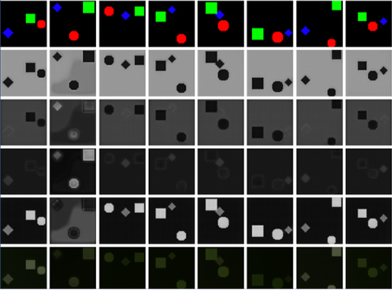
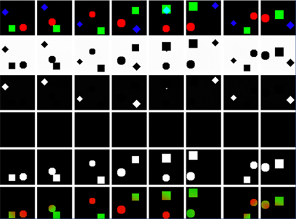
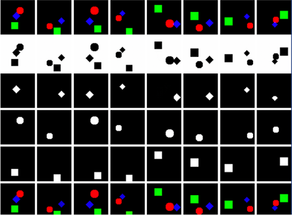
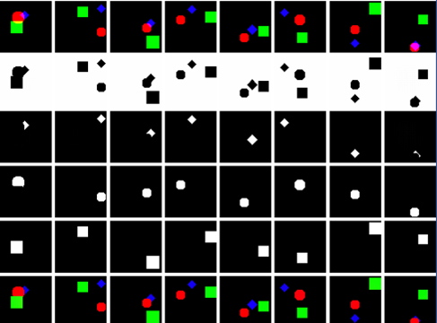
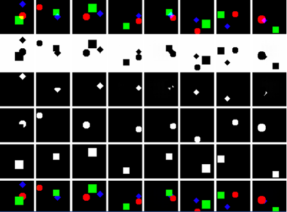
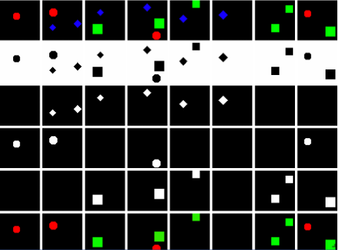
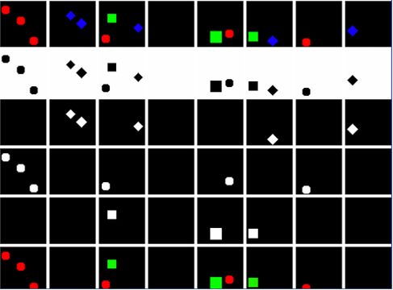

# Multi-Object Network (MONet): From scene decomposition to a transferable model of attention

**Psych 250/CS 431 Final Project**


_Stanford University. Winter, 2021._

---

**Team Members:** Benjamin Midler, Gongqi Li

---


## Description of the Network
The Multi-Object Network (MONet) implemented here is a combined variational auto-encoder (VAE) and attention network trained end-to-end in an unsupervised manner. The original goal of this network (https://arxiv.org/abs/1901.11390) is to test a CNN’s ability to decompose a simulated 3D environment into its constituent contents, along with figure-ground differentiation. Consequentially, MONet was able to represent the distinct elements of 3D environments as emphasized by the attention mask.

In this scenario, the attention mask indicates which image components should be attended-to by the VAE through its latent posterior distribution. The VAE computes the mask distribution and the probability of a given pixel belonging to an image component. MONet also features autoregression for the tracking of the parts of the image yet to be explained by model prediction. These components (see https://arxiv.org/abs/1901.11390 for more details) factor into the loss equation which was designed so that loss will decrease as the model learns masks corresponding to semantically important image features.

While the original intent of this model was to test the notion that, by learning consistent representations shared between images, a neural network can perform better on visual reconstruction tasks, our intent is to examine whether this representation-learning paradigm translate into robust visual scene decomposition, i.e., the segmentation of visual input into individual objects. Object perception, the ability to perceive and represent individual objects, is a fundamental cognitive ability that allows human’s effective understanding of the world as perceived through visual senses, and we examined here if such signature of development is presented in MONet.  

Furthermore, as object permanence and visual number sense are two key visual scene understanding properties originated from the skill of visual scene decomposition, we tested whether MONet display similar object permanence and visual number sense as humans. To be more specific, we ran two tests: the first one examined whether MONet has the ability to accurately infer objects in scenes with occlusion; the second one tested if MONet is able to segment objects into semantically meaningful slots with input images containing different number of objects.


## Code Details
The original design of MONet was conceived by Christopher P. Burgess, Loic Matthey, Nicholas Watters, Rishabh Kabra, Irina Higgins, Matt Botvinick, Alexander Lerchner (the paper can be found here: https://arxiv.org/abs/1901.11390). Our implementation, executed by Pytorch, is based on the project framework written by Jun-Yan Zhu and Taesung Park, and supported by Tongzhou Wang (https://github.com/baudm/MONet-pytorch). We extracted useful functions from their repository, and implemented in Google Colab.

Structure of the Project:

- Model (Module)
			- Contains 5 classes (UNet, AttentionNet, EncoderNet, DecoderNet, Monet) inherited from torch.nn.Module, we did not make any significant changes to this part.

- Datasets (Module)
			- This module build a dataset that is similar to the Sprites Dataset in the paper. The dataset consists of images with three different types of objects (squares, circles, or diamonds) with three different colours (red, green, or blue) and random scale and random positions.

- Visualisation (Module)
			- We rebuilt the visualisation function to make it able to extract informations from all of the attention masks, while comparing them with the reconstructed images and original images, using the visdom platform.

- Training (Module)
			- This module contains function that runs the training and testing loop. We rebuilt the function and make it tracing all three components of the loss (reconstruction loss, latent posterior KL divergence, and masks KL divergence).

- Config (Module)
			- Contains hyper parameters of the model and the training process.


## Getting Started
Run the PSYCH250_Project_MONet.ipynb with Google Colab.

Go to "Runtime" -> "change runtime type" and then select "GPU".

Import required packages:
```bash
import sys
from collections import namedtuple
import torch
import torch.nn as nn
import torchvision
import torchvision.transforms as transforms
import torch.optim as optim
import torch.distributions as dists
from torch.utils.data import Dataset
import numpy as np
from numpy.random import random_integers
from PIL import Image
import matplotlib.pyplot as plt
```
Initialize Visdom for Visualization
```bash
! npm install -g localtunnel
get_ipython().system_raw('python3 -m pip install visdom')
get_ipython().system_raw('python3 -m visdom.server -port 6006 >> visdomlog.txt 2>&1 &')
get_ipython().system_raw('lt --port 6006 >> url.txt 2>&1 &')
import time
time.sleep(5)
! cat url.txt
import visdom
time.sleep(5)
vis = visdom.Visdom(port='6006')
print(vis)
time.sleep(3)
vis.text('MONet Visualization')
! cat visdomlog.txt
```
Run the code step-by-step and view the visualization result from the link from the second code block.


## Test Results

In the figures below, the first row corresponds to the raw image, the 2nd-5th row correspond to the four attention masks, respectively, and the last row represents the reconstructed image. Each column corresponds to one sample.

#### Tracing the Learning Trajectory
There are three stages of the training. In the first stage, the model first learns to distinguish between the background and the objects--the first attention mask always take care of the background--while the remaining three masks fail at object segmentation and the reconstruction is poor. This is indicated by a large VAE reconstruction loss.



In the second stage, the second attention mask learned to capture one object, while the last attention mask always captured the remaining two objects, and the mask in the middle did nothing. Attention masks are always built up in such an order. The reconstruction is better than in stage 1, (note that as circle and square are captured together in the last mask, the reconstruction image has color a combination of red and green).



In the third stage, each mask learns to capture only one object, which displays great object segmentation result. The reconstruction is perfect with colors and shapes matching the raw input.



#### Occlusion
Below are two examples of raw images with occlusion. Occlusion does not affect the reconstruction performance, as the model always allocates the overlapped part to one of the objects. However, on our dataset, we did not observe, as proclaimed by the paper "the unmasked reconstruction components of occluded objects showed
very coherent filling in of occluded regions." This might be the case because our dataset is 2D, while the dataset used by them (CLEVR) is 3D.





#### Visual Number Sense
The test the trained model on a dataset with various number of objects. As shown by the two figures below, the model generalizes well to different number of objects. We also observed that the activation of a certain attention mask can be a good indicator of whether a certain type of object exists in the image.
The aggregate number of activated masks can then be used to predict the number of objects within the image. However, in our experiment, this visual number sense is only based on color information, rather than more complicated features like shape and texture. This is epitomized by regions with the same color being clustered as a single object, even if they are spatially separated. One potential way to add spatial feature to the segmentation is by adding a spatial prior to the attention mask, which encourages the grouping of adjacent pixels.




